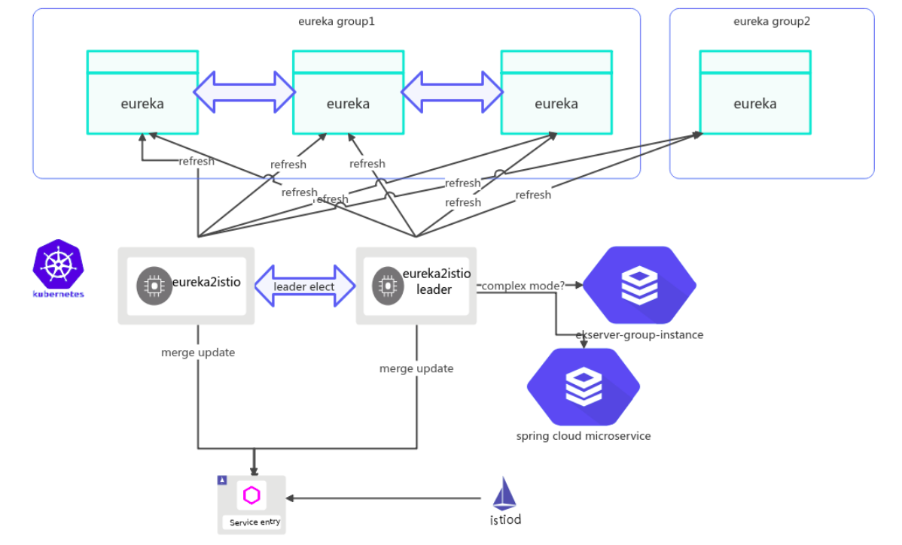
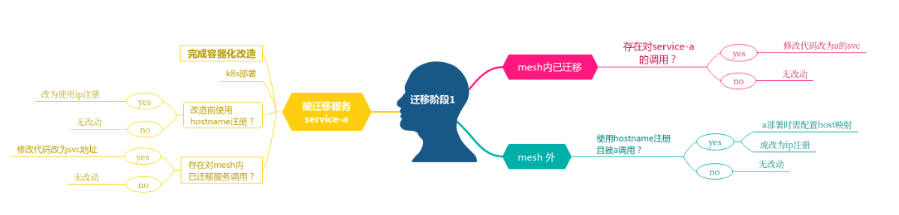
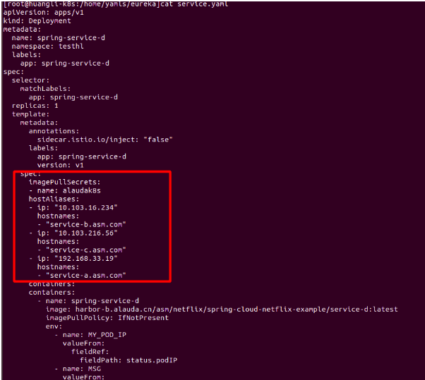
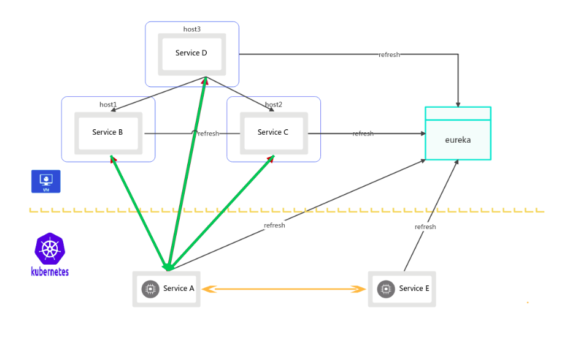
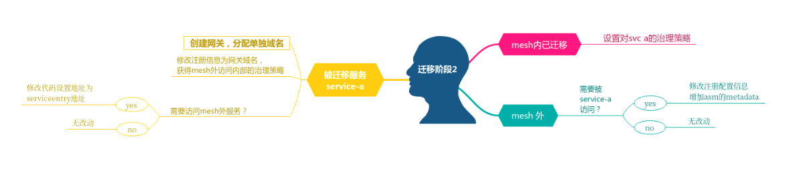
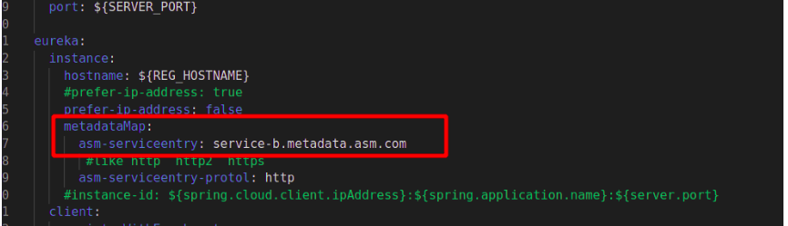
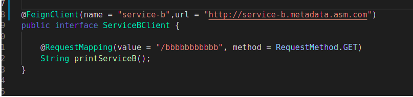
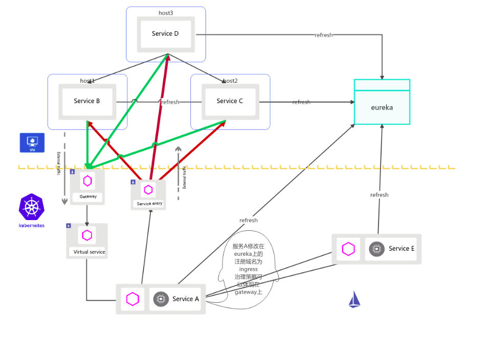

# Eureka2Istio

Eureka2Istio 将 Spring Cloud Netflix Eureka 服务注册表中的 Eureka 服务自动同步到 Istio 服务网格中。

Aeraki 根据 Eureka 服务信息和用户设置的路由规则生成数据面相关的配置，通过 Istio 下发给数据面 Envoy

1 架构
====

整体架构
----



  

  

迁移指南
----

  


  

  

### demo

Aeraki 提供了一个 Spring Cloud Netflix Demo 应用，用于使用该 Demo 来测试 Spring Cloud Netflix 应用的流量控制、metrics 指标采集和权限控制等微服务治理功能。
* [Demo k8s 部署文件下载](https://github.com/aeraki-framework/eureka2istio/tree/master/demo)
* [Demo Dubbo 程序源码下载](https://github.com/huanghuangzym/spring-cloud-netflix-example)

备注：该 Demo 应用基于开源 Istio 1.9(安装时需开启dnsAgent) + Aeraki 运行，也可以在 
[腾讯云 TCM (Tencent Cloud Mesh)](https://console.cloud.tencent.com/tke2/mesh?rid=8) 托管服务网格上运行。


demo中的serveice-b,c,d为网格外的服务,e为已迁移至mesh的服务,以迁移serveice-a为例

  

### 接入阶段

目标：

*   mesh内外可互相访问
*   mesh内部可治理



ip双向可路由

dns可双向寻址（若注册eureka使用hostname注册）

为什么service-a改用ip注册？

*   若继续使用host注册，上报的host是pod name，则无法被mesh外部需要访问a的服务调用

为什么mesh外服务改为ip注册？

*   若需要被a访问，由于k8s的pod默认不会继承主机的host解析，则需要在pod当中单独配置host解析映射关系

hostname部署时pod样例



  



  

  

### 治理阶段

目标

*   mesh内外双向可治理



获取治理能力

service-a 注册eureka时，使用asm平台创建的gateway地址，对于b，c，d访问a时，则自动使用的此gateway地址，原始feign client策略会被网关的治理策略取代，hytrix则继续生效

由于spring cloud的灵活性，策略可以设置在配置文件，代码等任意位置，以及spring cloud可能的策略，这里建议具体对接服务使用了哪些策略具体再分析

若service-b需访问外部的service-b，c，则b，c注册eureka时需带上asm的metadata信息



次时修改service-a调用service-b的代码，使用此地址，以feign为例



同理修改service-a 访问service-e的代码，替换为使用service-e的k8s svc

对于service-e，修改调用service-a的代码 改为使用service-a的svc

  

对于service-a的主调，被调，mesh 内外，分别对应修改，则完成service-a的迁移

  

  

  



  


## 安装 Demo 应用

执行下面的命令安装 Spring Cloud Netflix 应用：
```bash
kubectl create ns testhl
# TCM
kubectl label namespace testhl istio.io/rev=1-8-1
# Istio 1.9
# kubectl label namespace testhl istio-injection=enabled
git clone https://github.com/aeraki-framework/eureka2istio.git
cd eureka2istio
kubectl apply -f demo/k8s/ -n testhl
```
稍等片刻后验证部署的 Spring Cloud Netflix 应用。

```
NAME                                   READY   STATUS    RESTARTS   AGE     IP            NODE          NOMINATED NODE   READINESS GATES
eureka-0                               1/1     Running   0          170m    10.244.0.16   huangli-k8s   <none>           <none>
eureka-1                               1/1     Running   0          170m    10.244.0.17   huangli-k8s   <none>           <none>
eureka2istio-845478cd7d-26xth          1/1     Running   0          2m44s   10.244.0.46   huangli-k8s   <none>           <none>
spring-service-a-5f7659c6-t9xbt        2/2     Running   0          166m    10.244.0.18   huangli-k8s   <none>           <none>
spring-service-b-v1-6d8ffc8d4-8rnjk    1/1     Running   0          166m    10.244.0.19   huangli-k8s   <none>           <none>
spring-service-b-v2-56557c89df-t5bpz   1/1     Running   0          166m    10.244.0.21   huangli-k8s   <none>           <none>
spring-service-c-555b8859fb-lzz9p      1/1     Running   0          166m    10.244.0.22   huangli-k8s   <none>           <none>
spring-service-d-88797848d-wh6fd       1/1     Running   0          166m    10.244.0.23   huangli-k8s   <none>           <none>
spring-service-e-58cb6d5dbc-l98d5      2/2     Running   0          166m    10.244.0.20   huangli-k8s   <none>           <none>

```

可以看到 testhl namespace 中有下面的 pod：
* spring-service-a,b,c,d,e: spring cloud netflix 应用
* eureka-0,1: eureka 服务注册表
* eureka2istio: 服务同步组件，负责将 eureka 服务同步到服务网格中


## 一些限制

* 按照上述迁移步骤，对于spring cloud的应用（默认http）的基本客户端执行的sidecar策略，例如vs，dr等都可以直接创建使用了